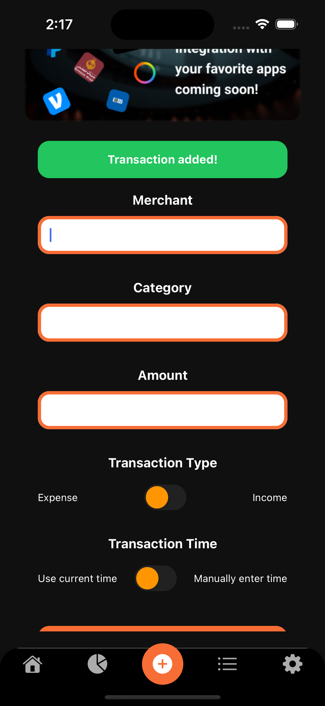

# Financial Freedom Companion: Personal Budget Maestro

## Project Overview

A comprehensive personal budget tracking mobile application developed as part of a senior React Native developer job application at Foodics.

  [Watch the project overview on Loom](https://www.loom.com/share/3081b1ac448b40659042c948e42e5dd0?sid=b59e5261-6f0a-4559-b914-f67f192c4dd5)

## Features

### Core Functionality

- **Dashboard**
  - Total income, expenses, and remaining balance visualization
  - Expense categories chart (Pie Chart)
  - 10 most recent transactions display

- **Expense Breakdown**
  - Pie chart of spending categories
  - Stacked bar chart for income sources
  - Financial insights and advice links

- **Transaction Management**
  - Manual transaction entry
  - Flexible date and time logging
  - Income and expense categorization

- **Transaction History**
  - Comprehensive transaction list
  - Sorting capabilities

- **Settings**
  - Theme customization
  - Multi-language support
  - Currency conversion
  - Personal profile settings

### Bonus Features

- Dark mode implementation
- Input validation
- Unit testing
- Internationalization (i18n)
- Multi-currency support

## Technical Stack

- **Framework**: React Native (Expo SDK 52)
- **Language**: TypeScript
- **State Management**: Redux
- **Styling**: Tailwind (Native Wind)
- **Persistent Storage**: AsyncStorage
- **API Integration**: Mock API (mockapi.io)

## Color Palette

```javascript
colors: {
  "budget-midnight": "#000000",
  "budget-charcoal": "#101010",
  "budget-steel": "#2A2A2A",
  "budget-silver": "#ACACAC",
  "budget-cloud": "#F5F5F5",
  "budget-snow": "#FEFEFE",
  "budget-tangerine": "#F76D35",
  "budget-expense": "#FF1919",
  "budget-income": "#00B232"
}
```

## Project Structure

- `__mocks__`: Mock implementations for testing
- `__tests__`: Test files and test suites
- `app/`: Entry point & app screens
- `types/`: TypeScript type definitions
- `constants/`: Variables & dummy data
- `utils/`: Utility functions
- `hooks/`: Custom React hooks
- `services/`: API service from MockAPI.io
- `components/`: Reusable UI components
- `redux/`: Frontend storage (e.g., state management)
- `locales/`: Language files for i18n (internationalization)
- `scripts/`: Custom scripts for development automation
- `assets/`: Static assets like images, fonts, etc.
- `.expo/`: Expo-specific project configuration
- `.vscode/`: Editor settings and extensions
- `.env`: Environment variables configuration
- `.eslintrc`: Airbnb's ESLint configuration file
- `jest.config.js`: Jest configuration file
- `jest.setup.js`: Jest setup file for configuring the testing environment
- `app.json`: Expo configuration
- `babel.config.js`: Babel configuration for the project
- `metro.config.js`: Custom Metro bundler configuration
- `tailwind.config.js`: Tailwind CSS configuration
- `tsconfig.json`: TypeScript configuration file
- `README.md`: Project documentation

## Development Approach

- Modular design
- Clean code practices
- Chronological imports
- Comprehensive commenting
- Performance optimization

## Mission: Financial Clarity & Control

This Budget Tracker transforms complex financial data into actionable insights, empowering users to:

- Decode personal spending patterns
- Gain comprehensive financial understanding
- Make informed monetary decisions

## Future Vision

- Banking & Fin-tech app integration
- Advanced financial insights
- Sending payments directly in-house
- Enhanced data visualization
- AI-powered financial coaching
- Global financial ecosystem connections

## Prerequisites

- Node.js
- npm or Yarn
- Expo CLI
- Android Studio
- Xcode Dev Tools
- Visual Studio Code

## Installation

1. Clone the repository
2. Install dependencies:

   ```bash
   npm install
   # or
   yarn install
   ```

3. Start the application:

   ```bash
   npx expo start
   ```

## Testing

- Unit tests for core functions
- Component-level testing

## License

Private project developed for Foodics job application. Not for public distribution.

## Preview





---

**Note**: This application was developed as a technical assessment for a senior React Native developer position.
